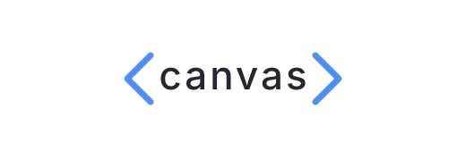

<p align="center">
  
</p>

<p align="center">
  Self-hosted streaming client for constrained in-vehicle browser environments.<br/>
  Plays Plex, Flixify, and YouTube sources via a canvas + WebCodecs pipeline instead of <code>&lt;video&gt;</code>,<br/>
  so it works where native HTML5 playback is restricted.
</p>

<p align="center">
  
  
</p>

---

> Passenger entertainment only — not for the driver, not for a moving vehicle.

## Highlights

- **Docker-first.** One `docker-compose up -d` and you're running.
- **Auto-updating.** Bundled [Watchtower](https://containrrr.dev/watchtower/) checks ghcr every 5 minutes and rolls forward without downtime.
- **Multi-user with per-source access control.** Plex-Home-style — admins add sources, share what they want per household member.
- **Deploy modes for any network posture.** Local, Cloudflare Quick Tunnel, Cloudflare Named Tunnel, or your own domain with automatic Let's Encrypt certs.
- **Diagnostics-first.** Every player event lands in a ring buffer; fatal errors surface in a local admin viewer with a full trace.
- **MIT licensed.**

## Quick start (recommended)

1. Download the compose file:
   ```
   curl -O https://raw.githubusercontent.com/bleichroeder/canvas/main/docker-compose.yml
   ```
2. Start canvas + auto-updater:
   ```
   docker-compose up -d
   ```
3. Open http://localhost:8787/setup and follow the wizard.

Canvas keeps itself up to date via [Watchtower](https://containrrr.dev/watchtower/), bundled in the compose file. See [docs/updates.md](docs/updates.md) for details.

### Advanced — plain `docker run`

If you'd rather not use compose (or Watchtower), you can run canvas directly:

```
docker run -d --restart unless-stopped --name canvas \
  -p 8787:8787 -p 80:80 -p 443:443 \
  -v canvas-data:/data \
  ghcr.io/bleichroeder/canvas:latest
```

You'll be responsible for pulling updates. See [docs/updates.md](docs/updates.md).

Then open **`http://localhost:8787/`** in a browser. The setup wizard walks you through:

1. **Create admin account** — username + password. Localhost / LAN only until you complete the wizard.
2. **Pick how canvas is exposed** — four modes to choose from (details in [`docs/deployment-modes.md`](docs/deployment-modes.md)):
   - **Cloudflare Quick Tunnel** *(recommended default)* — one click, no signup, canvas gets a public `<random>.trycloudflare.com` URL
   - **Custom domain + Let's Encrypt** — bring your own domain, forward ports 80/443, canvas auto-fetches a cert
   - **Cloudflare Named Tunnel** — paste a token from your CF Zero Trust dashboard for a stable URL
   - **Local only** — HTTP on 8787, LAN-only access
3. **Apply** — canvas restarts, obtains TLS certs / opens the tunnel (~5-30 seconds), then shows your public URL

Bookmark that URL on your in-car browser (or any device); sign in with the admin credentials you just created.

## Adding sources

Once signed in: **Settings → Sources → Pair new source**. Scan the QR from your phone, complete the Plex sign-in on the phone. Canvas remembers the source per-user; multi-user households can grant/revoke each source per-user in Settings → Users.

**YouTube** (public, ad-free) is added without pairing — just pick it from the same **Pair new source** screen. See [docs/youtube.md](docs/youtube.md).

## Adding users

Admin: **Settings → Users → Add user** (label + initial password). Share with the family member; they sign in from any device with those credentials. Individual users see only sources the admin has granted them.

## Changing deployment mode later

**Settings → Deployment** (admin only). Same 4-mode picker as the wizard, plus current status + cert expiry. Changing modes triggers a ~10-second container restart.

## Advanced: external reverse proxy

If you'd rather run your own reverse proxy in front of canvas:

```bash
docker run -d --restart unless-stopped \
  -e CANVAS_EXTERNAL_PROXY=1 \
  -p 8787:8787 \
  -v canvas-data:/data \
  ghcr.io/bleichroeder/canvas:latest
```

Canvas skips its bundled Caddy + cloudflared and runs HTTP-only on `:8787`. Point your existing nginx / Traefik / Caddy / Cloudflare Tunnel / Tailscale at that. Settings → Deployment shows "Managed externally."

## Updating

```bash
docker pull ghcr.io/bleichroeder/canvas:latest
docker restart canvas
```

Volume state (`canvas-data`) survives updates: SQLite DB, deployment config, Caddy certs (if applicable).

## Configuration

### Environment variables

| Var | Default | Description |
|---|---|---|
| `CANVAS_PORT` | `8787` | Internal Bun server port |
| `CANVAS_DB_PATH` | `/data/canvas.db` | SQLite path |
| `CANVAS_WEB_DIR` | `/app/web` | Static frontend dir (rarely changed) |
| `CANVAS_DATA_DIR` | `/data` | Persistent state root |
| `CANVAS_EXTERNAL_PROXY` | (unset) | `1` = disable bundled Caddy/cloudflared |
| `CANVAS_ALLOWED_ORIGINS` | `http://localhost:5173` | Comma-separated CORS allowlist (dev only; ignored in bundled-proxy modes since everything is same-origin) |

### Diagnostics

Canvas records player errors locally to help you debug playback issues. Everything stays on your server — no third-party data collection. See [docs/diagnostics.md](docs/diagnostics.md).

Env: `TELEMETRY_ENABLED` (default `true`), `TELEMETRY_RETENTION_DAYS` (default `30`), `TELEMETRY_MAX_ROWS` (default `1000`).

## Layout

- `server/` — Bun + Hono + Drizzle + SQLite backend. See `server/README.md` for dev commands.
- `web/` — Vite + React + MUI frontend. Built + bundled into the Docker image; `cd web && npm run dev` for hot-reload dev.

Design docs: `docs/superpowers/specs/`. Implementation plans: `docs/superpowers/plans/`.
